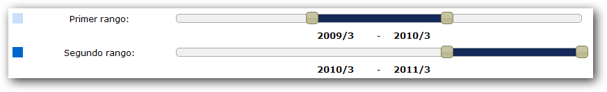
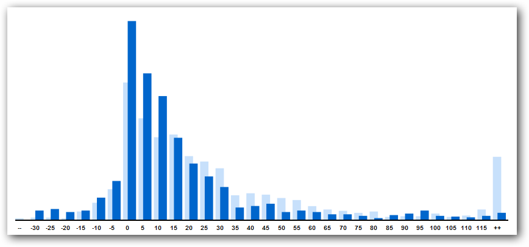
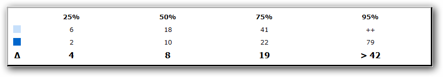

Esta herramienta permite a los usuarios tener una visión rápida y
sencilla del modo en que las facturas de la empresa han sido pagadas en
distintos períodos de tiempo.

## ¿Cómo se usa?

En la parte inferior de la página se encuentran dos barras deslizadoras
que representan los rangos de fechas sobre los cuales se evaluará el
comportamiento de pago. Los usuarios podrán mover estas barras,
cambiando el mes y el año a evaluar. Una vez seleccionados los rangos de
fechas, se debe presionar sobre el botón "Evaluar" para observar los
resultados.

El resultado de la selección de un rango de fechas lo observamos en el
histograma en la parte central de la página, donde cada barra representa
la cantidad de facturas y el eje 'x' representa las categorías de días
de retraso sobre el pago total de las facturas. La categoría '--'
representa todos los días de retraso menores a la primera categoría, y,
de forma análoga, la categoría '++' representa todos los días mayores a
la última categoría.

Justo abajo del histograma se observa una tabla con varios indicadores.
Para cada rango se indica una cantidad de días para los cuales la
proporción de facturas, indicada en la primera fila de la tabla, es
cobrada (esto es, el límite superior de días en que se cobran). La
última fila de esta tabla muestra al usuario la diferencia de días
existente entre los dos rangos de fechas comparados, en otras palabras
nos indica si la cobranza ha mejorado o empeorado y por cuánto, para
cada proporción de facturas.

En la parte superior, el usuario puede seleccionar la granularidad en la
que se efectúa el análisis, modificando en gran medida la visualización
del mismo. Igualmente se pueden seleccionar los negocios sobre los
cuales se desea realizar el análisis. Estos aparecerán en la parte
superior derecha de la página.

## ¿Cómo funciona?

Cuando se seleccionan los rangos de fechas y se presiona el botón
"Evaluar", se envía al servidor dicha información con el fin de realizar
una consulta a la base de datos del sistema, pidiendo los días de
retraso ponderados (tomando en cuenta la forma en que fueron realizados
todos los pagos con respecto al vencimiento y sus respectivos montos) de
todas las facturas emitidas dentro de los rangos de fechas seleccionados
y que ya fueron pagadas en su totalidad. Esta soliticud es recibida por
la página como un arreglo de datos.

La granularidad determina el número de días consecutivos en que se deben
sumar la cantidad de facturas por abajo de la categoría del día cero
(día en que se vence la factura) y por arriba de dicho día,
incluyéndolo.

La selección de los negocios determina sobre cuáles facturas se van a
evaluar los días de retraso ponderados.

## ¿Qué se puede concluir con el análisis?

Cada vez que se toma una decisión en la empresa, ya sea de tipo
administrativa, estratégica o circunstancial, se desea conocer el
impacto sobre el proceso de cobranza. Se desea responder a preguntas
tales como:

**¿Estoy cobrando más rápido?**

**¿Mis decisiones tienen un impacto positivo?**

**¿Cómo afecta la situación actual de mis clientes o de mi propia
empresa en mis cobranzas?**

**¿Cómo han cambiado los pagos de mis facturas con respecto a períodos
anteriores?**

**¿Deben ser revisadas mis políticas de crédito?**

**¿Qué impacto tienen mis políticas y mis decisiones sobre una
determinada proporción de las facturas de la empresa?**

Preguntas como las anteriores se pueden responder observando el
comportamiento de pago de los clientes de la empresa en períodos de
interés, que al final representa una reacción frente a las decisiones de
la empresa o frente a una situación externa en particular. La tabla de
indicadores muestra de forma muy sencilla si dicho comportamiento de
pago ha mejorado o empeorado en distintas proporciones de las facturas,
de modo tal que es medible el esfuerzo de la empresa.
