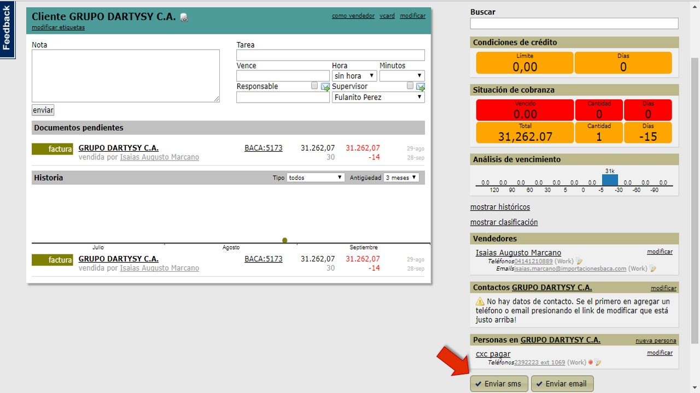
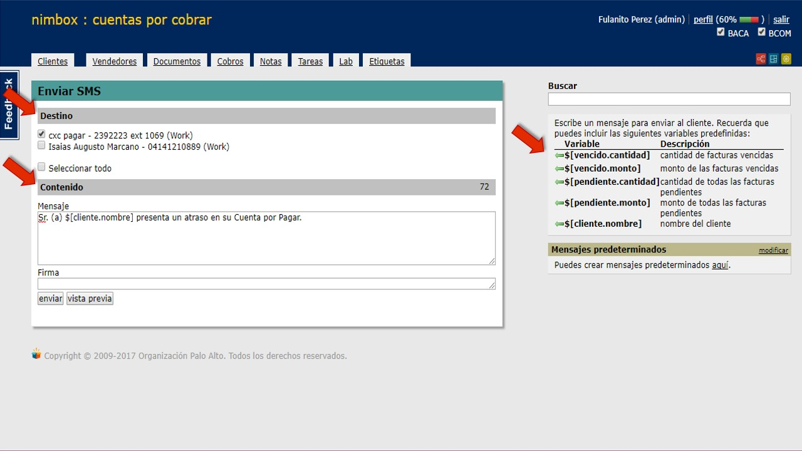
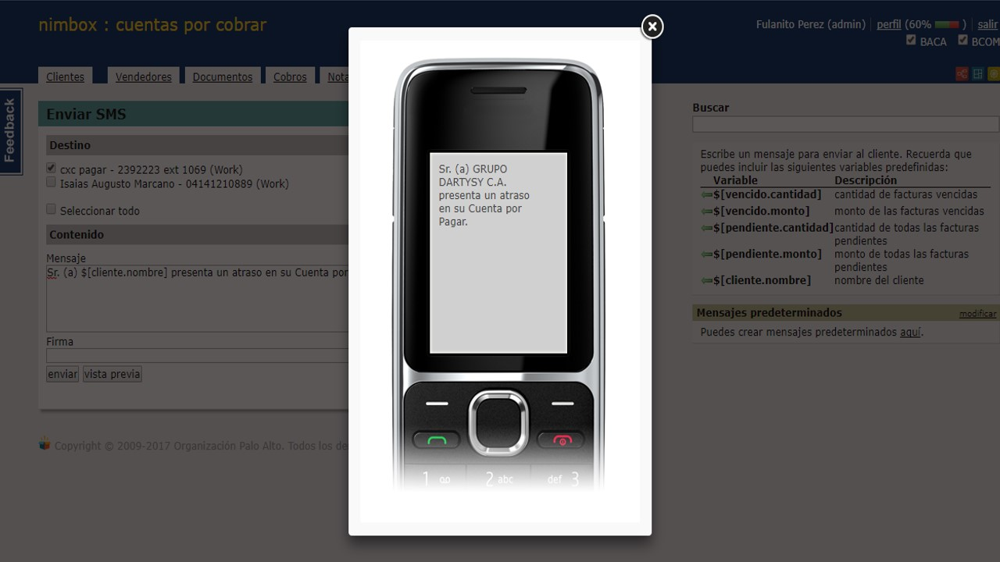
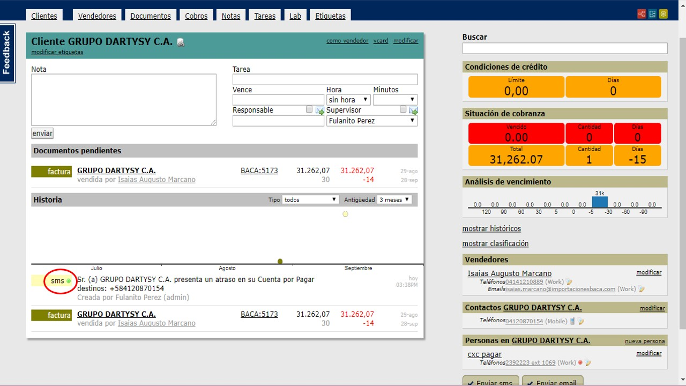

'''

## Procedimiento:

'''

Para el envío de SMS debemos estar en el muro de un cliente presionamos
el botón \[Enviar sms\]

La próxima página permite realizar las siguientes selecciones:

1.- Destino: Nombre y número de teléfono de la persona a quien va
dirigido el SMS.

2.- Contenido: Colocamos el cuerpo del mensaje, y la posibilidad de
añadir variables predefinidas.

Puedes visualizar como llagará el mensaje presionando el botón (vista
previa), Por último presionar el botón \[Enviar\]

En el muro del cliente podemos visualizar según el color del punto del
SMS si fue enviado satisfactoriamente.

Amarillo: Cola de envío

Verde: Envío satisfactorio

Rojo: fallo de envío.

