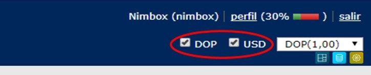

El Multimoneda permite ver la situación de cobranza de la empresa en la
moneda de su interés (dolar o pesos), como también hacer la conversión
de pesos a dolares o viceversa. Adicional seleccionar el tipo de
documento que se desea ver en la aplicación.

Funciona de la siguiente manera:

1.- En estas casillas podemos seleccionar el tipo de documento que se
quiere visualizar. En pesos, dolares o ambos.

2.- Y en esta podemos seleccionar el tipo de moneda al cual queremos
hacer la conversión.

Ejemplos del multimoneda:

  - Visualizar documentos emitidos en Dolares y convertidos a Pesos

  - Visualizar documentos emitidos en Pesos y convertidos a Dolares

[Category:FAQ](Category:FAQ "wikilink")
