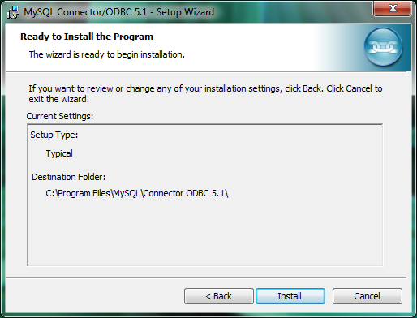
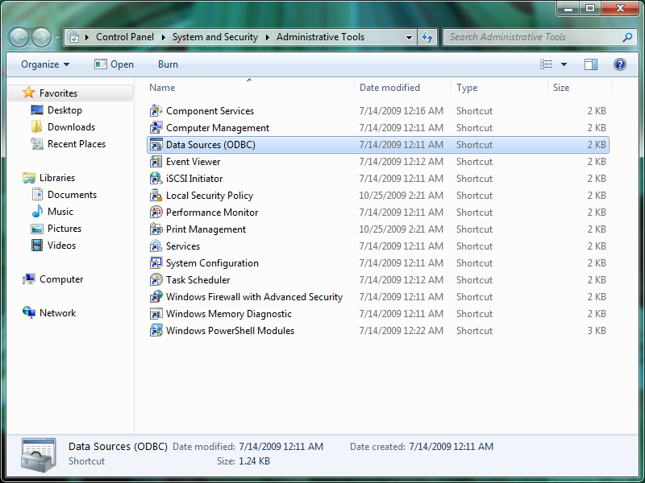

Para hacer uso de las hojas de excel con análisis ad-hoc que realizamos
es necesario instalar el conector de MySQL y configurarlo para
conectarse con el servidor . Para realizar la configuración y conexión
es necesario seguir estos pasos:

## Windows

### Descargar el conector de MySQL

El conector es una aplicación que permite acceder los datos de NiMbox
desde cualquier servidor. Este conector se baja directamente de Oracle
en <http://dev.mysql.com/downloads/connector/odbc/>. Seleccionar la
versión de windows requerida, la modalidad del paquete MSI o ZIP, y si
es 32 o 64 bits. En general es Windows, MSI, 32 bits.

Seleccionar la localidad desde donde se desea bajar el conector.

### Instalar el conector

Ejecutar el archivo bajado y pasar por la siguiente secuencia:

### Configurar el conector

Ubicar el manejador de fuentes ODBC y seleccionarlo.

Agregar el conector a NiMbox pasando por la siguiente secuencia:

Finalmente hay que incorporar los datos de la conexión. Se deben
colocar:

  - la dirección IP del servidor NiMbox
  - el identificador del usuario (típicamente 'reader')
  - la clave del usuario (típicamente 'readonly')

Al finalizar ya debes tener una conexión a la base de datos .
