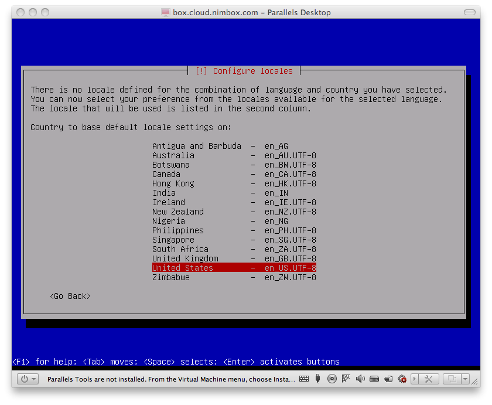
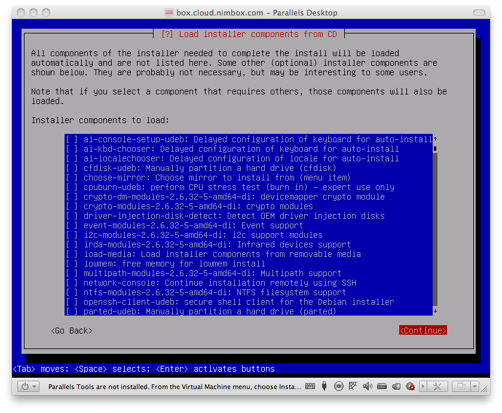
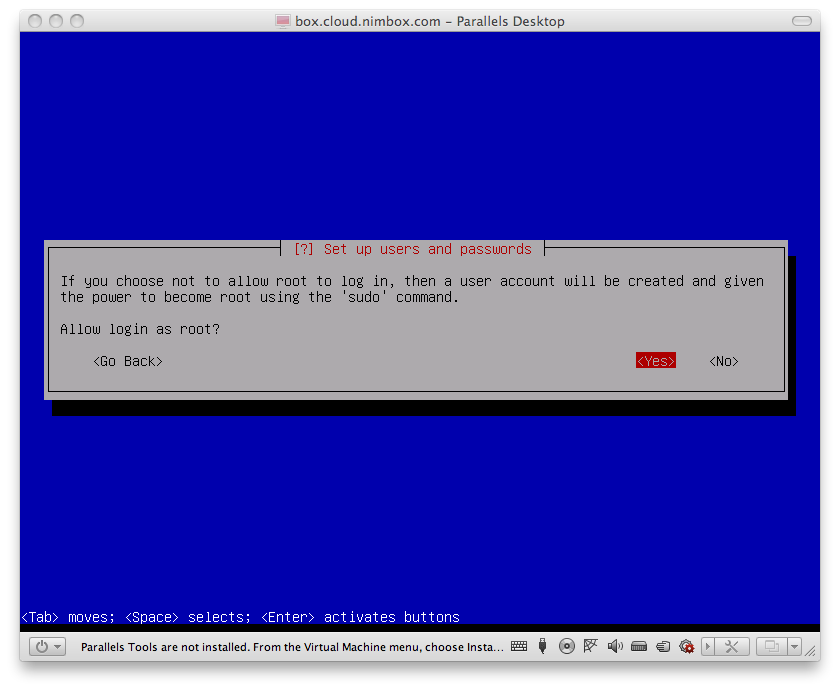
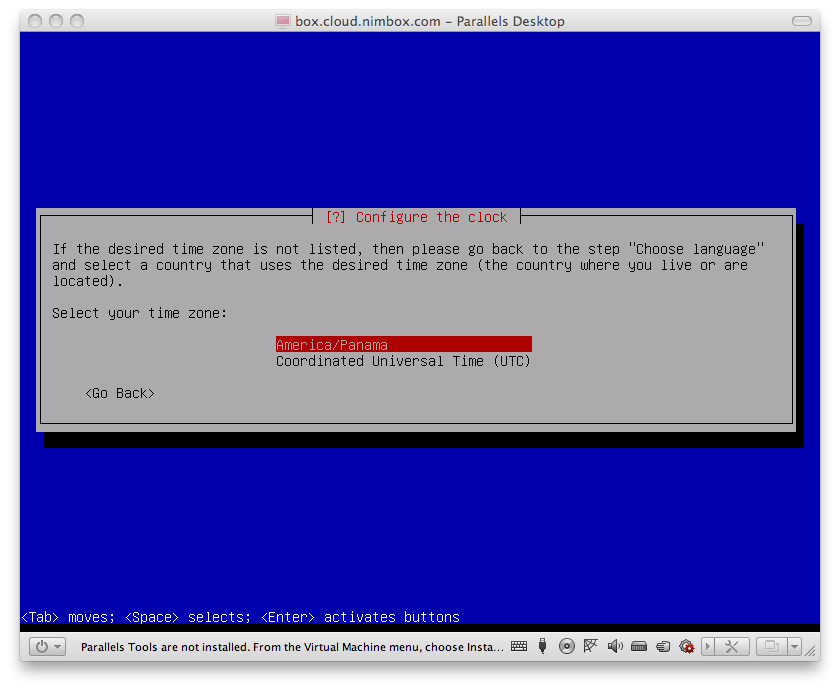

Hay que utilizar la versión de debian 8.9.0 de 64 bits en inglés que se
puede descargar
[aquí](https://cdimage.debian.org/cdimage/unofficial/non-free/cd-including-firmware/archive/8.9.0+nonfree/amd64/iso-cd/firmware-8.9.0-amd64-netinst.iso)
Una vez decargada la imagen, y quemada en un cd, se sigue esta secuencia
de pasos hasta completar la instalación. Hay varias consideraciones
importantes:

  - El servidor debe tener ciertas características básicas:
      - Robusto en cuanto a los circuitos, la fuente de poder y la caja
        (no recomendamos un clon de baja calidad)
      - Un procesador Core 2 Duo de 2.0GHz o mejor
      - 4 Gbytes de ram (mas si el volumen transaccional us muy alto)
      - 160 Gbytes de disco duro.
  - El servidor debe estar conectado a una red con
    [`DHCP`](http://es.wikipedia.org/wiki/Dynamic_Host_Configuration_Protocol)
    y debe tener acceso a internet.
  - Hay que cambiar todos los lugares que dicen `box` por el nombre de
    la instalación que se está realizando. Este nombre debe ser
    entregado por el equipo técnico de .
  - El password del usuario `root` debe ser `root` hasta que se finalice
    el proceso de instalación. Luego se puede cambiar a cualquier otro
    password que se acuerde con el cliente que tendrá el servidor en sus
    premisas.

## Al arrancar el servidor con el CD

## Al comenzar la instalación en modo experto

## Al culminar la instalación

El servidor deberá reiniciar para que aparezca la siguiente pantalla
indicando que la instalación fue exitosa:

