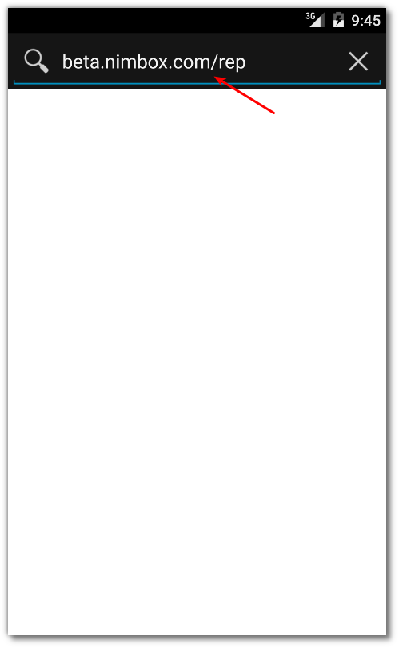

Para unirse al Beta de OnTrack primero hay que permitir al dispositivo
la instalación de aplicaciones provenientes de fuentes desconocidad.
Esto es necesario ya que mientras la aplicación esta en periodo de
pruebas (Beta), no se distribuye a través del Google Play Store. Si lo
deseas, una vez instalada la aplicación puedes venir de regreso para acá
y desactivar esta
opción.

## Configurando el dispositivo

[descargar](https://play.google.com/apps/testing/com.nimbox.mobexer.ontrack)

[descargar](https://play.google.com/store/apps/details?id=com.nimbox.mobexer.ontrack)

### Seguridad del dispositivo

| Inicio                                                       | Configuración                                                     | Seguridad                                             |
| ------------------------------------------------------------ | ----------------------------------------------------------------- | ----------------------------------------------------- |
|                                                              |                                                                   |                                                       |
|      |  |  |
| Encender el dispositivo e ir a la pantalla inicial del mismo | Buscar la aplicación de **Configuración**                         | Entrar a las opciones de **Seguridad**                |

### Instalación de aplicaciones de fuentes desconocidas

| Opción de fuentes desconocidas                                                      | Confirmación                                                                                             | Configuración lista                                                                       |
| ----------------------------------------------------------------------------------- | -------------------------------------------------------------------------------------------------------- | ----------------------------------------------------------------------------------------- |
|                                                                                     |                                                                                                          |                                                                                           |
|  |  |  |
| Buscar y **activar** la opción de instalar aplicaciones desde fuentes desonocidas   | Hacer click en **Aceptar**                                                                               | **Verificar** que la opción aparezca activada                                             |

## Instalando la aplicación

### Descargar la aplicación

| Inicio                                                                                | Navegador                                                                 | Descarga del instalador                                                   |
| ------------------------------------------------------------------------------------- | ------------------------------------------------------------------------- | ------------------------------------------------------------------------- |
|                                                                                       |                                                                           |                                                                           |
|  |  |  |
| **Abrir** el navegador de internet del dispositivo                                    | Navergar a: **beta.nimbox.com/rep**                                       | **Descargar** el instalador Android de la aplicación                      |

### Ejecutar el instalador

| Desplegando el instalador                                                                            | Instalar                                                                              | Abrir                                                                        |
| ---------------------------------------------------------------------------------------------------- | ------------------------------------------------------------------------------------- | ---------------------------------------------------------------------------- |
|                                                                                                      |                                                                                       |                                                                              |
|  |  |  |
| **1- Primero deslizar** el menu superior; **2- Luego seleccionar** el instalador recién descargado   | Proceder a presionar el botón de **Instalar**                                         | Al terminar, presione **Abrir**                                              |

## Próximos Pasos

Ahora a usar la aplicación\!

Tan pronto como abres OnTrack, te darás cuenta que necesitas unas
credenciales de acceso. Si aún no cuentas con ellas escríbenos a
[soporte@nimbox.com](mailto:gvelasquez@gmail.com), y tan pronto como nos
sea posible te estaremos contactando para entregarte tus credenciales de
acceso.

Vamos\! Sal y vende de una forma más eficiente, con el apoyo que te
brinda OnTrack\!

[Category:FAQ](Category:FAQ "wikilink")
